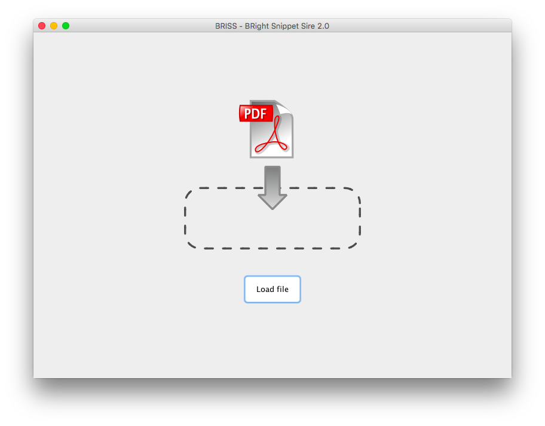
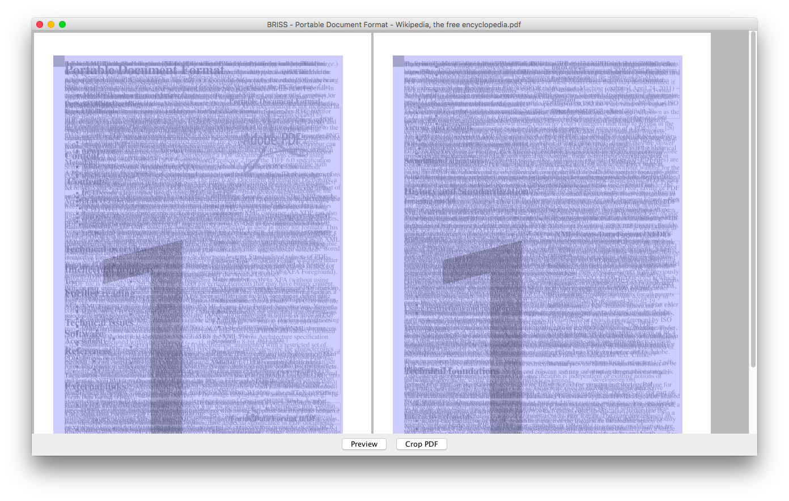

#PDFAutoSlicer

Fork of 

## Usage
You can run the application by double-clicking on `./lib/Briss-2.0-all.jar` or executing the following command in terminal:

```
./bin/Briss-2.0
```
or
```
./bin/Briss-2.0 cropthis.pdf
```

## Commandline

If you prefer command line and trust the basic automatic detection algorithm
use it this way:

```
./bin/Briss-2.0 -s [SOURCEFILE] [-d [DESTINATIONFILE]]
```
Example:
```
./bin/Briss-2.0 -s dogeatdog.pdf -d dogcrop.pdf
./bin/Briss-2.0 -s dogeatdog.pdf
```
the second line will create the cropped pdf into `dogeatdog_cropped.pdf`

To split according to columns/rows, respectively use the `--split-col` and `--split-row` arguments. For example:
```
./bin/Briss-2.0 -s dogeatdog.pdf -d dogcrop.pdf --split-col
```

Splitting columns will try to split the pdf into two columns. Splitting rows will try to split the pdf into two parts
by cutting pages in half.

## Images

Startscreen with drag and drop support:

Cropping view:


## Improvements done
- Small refinements on gui which improve the workflow
- Better file chooser than provided by swing
- Added support for drag and drop
- Fixed an issue with the image preview showing nothing when all pages look mostly the same

## Build instructions

### Prerequisites
Make sure you have JDK 11 or later installed.

### Build
To build, run the following command:

```
./gradlew shadowDistZip
```

You can find the built version in `build/distributions`

## Libraries used
 * This software uses two libraries to render and crop PDF files: 
  * itext (AGPLv3) http://itextpdf.com/ 
  * jpedal (LGPL) http://www.jpedal.org/
  * JavaFX (GPLv2) https://openjfx.io
  
